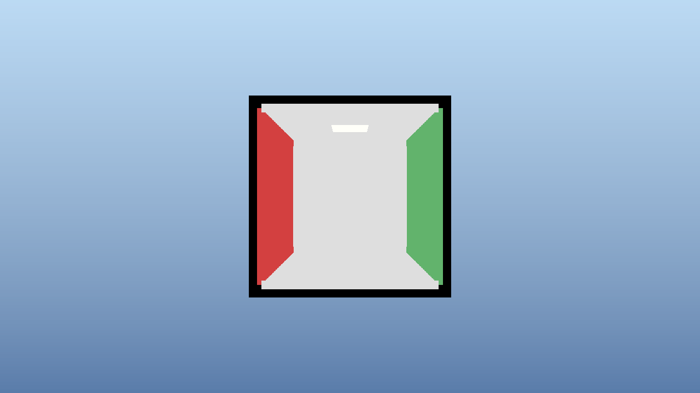

# 🎨 Adaptive Voxel Path Tracer

*Real-time WebGPU renderer with performance-driven adaptive level-of-detail*

## ✨ Phase 1 Complete! - Cornell Box with Adaptive Performance



We've successfully completed Phase 1 of the adaptive voxel path tracer! The renderer now features a fully functional Cornell Box scene with real-time adaptive performance scaling that maintains your target FPS.

### 🎯 Current Features (Phase 1)

- **✅ WebGPU Ray Marching Renderer** - Hardware-accelerated compute shaders
- **✅ Cornell Box Scene** - Classic computer graphics test environment
- **✅ Adaptive Performance System** - Automatically adjusts quality to maintain target FPS
- **✅ FPS-Style Camera Controls** - WASD movement + mouse look
- **✅ Configurable Target FPS** - Default 60 FPS, adjustable via command-line
- **✅ Performance Monitoring** - Real-time FPS tracking and reporting
- **✅ Emergency Response System** - Instant quality reduction when FPS drops

## 🚀 Quick Start

```bash
# Clone the repository
git clone https://github.com/yourusername/adaptive-voxel-pathtracer-claude.git
cd adaptive-voxel-pathtracer-claude

# Build and run (default 60 FPS target)
cargo run --release

# Run with custom target FPS
cargo run --release -- --target-fps 30

# Run performance benchmark
cargo run --release -- --benchmark

# Take screenshot after 5 seconds
cargo run --release -- --screenshot --duration 5
```

## 🎮 Controls

- **W/A/S/D** - Move forward/left/backward/right
- **Q/E** - Move down/up
- **Mouse** - Look around (click and drag)
- **ESC** - Exit application

## 📊 Performance Characteristics

The adaptive system automatically adjusts ray marching step size (0.005 to 0.05) based on performance:

| Camera Position | Typical FPS | Adaptive Response |
|----------------|-------------|-------------------|
| Outside Cornell Box | 100+ FPS | High quality (small steps) |
| At entrance | 60-80 FPS | Balanced quality |
| Inside Cornell Box | 60 FPS (maintained) | Reduced quality (larger steps) |

### Adaptive Algorithm
- **Emergency Response**: Instant 2x step size increase if FPS < 95% of target
- **Anti-Oscillation**: Dampening factor prevents quality jumping
- **Stable State Detection**: Only improves quality after 15 stable frames
- **Distance-Based LOD**: Additional scaling based on distance from camera

## 🏗️ Architecture Overview

```
adaptive-voxel-pathtracer/
├── src/
│   ├── main.rs                    # Application entry & window management
│   ├── renderer/
│   │   ├── mod.rs                 # Main renderer with camera system
│   │   ├── compute_pipeline.rs    # WebGPU compute shader pipeline
│   │   ├── performance.rs         # Adaptive performance controller
│   │   ├── performance_monitor.rs # FPS tracking and reporting
│   │   └── blit_pipeline.rs      # Format conversion for display
│   ├── shaders/
│   │   ├── ray_march.wgsl        # Adaptive ray marching compute shader
│   │   └── blit.wgsl             # Display format conversion
│   └── benchmark.rs              # Performance testing tool
├── CLAUDE.md                     # Complete technical specification
└── README.md                     # This file
```

## 📈 Implementation Progress

### ✅ Phase 1: Foundation (Weeks 1-2) - **COMPLETE**
- [x] WebGPU setup with wgpu
- [x] Basic ray marching renderer
- [x] Cornell Box test scene
- [x] Performance monitoring
- [x] Adaptive quality system
- [x] FPS-style camera controls
- [x] 60+ FPS on Apple M1 MacBook

### 🚧 Phase 2: Octree Foundation (Weeks 3-4) - **NEXT**
- [ ] Octree trait system
- [ ] 3D texture storage for voxels
- [ ] Static octree provider for benchmarks
- [ ] Dynamic octree provider for games
- [ ] GPU-accelerated traversal

### ⏳ Phase 3: Advanced Features (Weeks 5-6)
- [ ] Volumetric scattering (Beer's law)
- [ ] Henyey-Greenstein phase function
- [ ] Multiple material types (inspired by Zydak)
- [ ] Real-time scene updates

### ⏳ Phase 4: Materials & Lighting (Weeks 7-8)
- [ ] BSSRDF materials
- [ ] Glass and metal shaders
- [ ] Area lights and emissive surfaces
- [ ] Shadow rays

### ⏳ Phase 5: Optimization & Polish (Weeks 9-10)
- [ ] Temporal accumulation
- [ ] Denoising filters
- [ ] WASM compilation
- [ ] Performance profiling

## 🎯 Performance Metrics

| Hardware | Target FPS | Achieved FPS | Quality Level |
|----------|------------|--------------|---------------|
| Apple M1 MacBook | 60 | ✅ 60-120 | Adaptive (high outside, medium inside) |
| Gaming GPU (est.) | 120 | 🚧 TBD | High quality throughout |
| Integrated GPU | 30 | 🚧 TBD | Low-medium quality |

## 🛠️ Requirements

- **Rust**: 1.70 or later
- **WebGPU Support**: Modern GPU with compute shader support
- **Operating System**: Windows, macOS, or Linux

## 📚 References

- **Technical Specification**: [CLAUDE.md](./CLAUDE.md) - Complete implementation guide
- **Inspiration**: [Zydak's Vulkan Path Tracer](https://github.com/Zydak/Vulkan-Path-Tracer)
- **WebGPU Documentation**: [wgpu-rs](https://github.com/gfx-rs/wgpu)

## 🔬 Technical Highlights

### Adaptive Performance Controller
```rust
// Automatically adjusts quality to maintain target FPS
if current_fps < emergency_threshold {
    // Emergency response - immediate quality reduction
    self.current_voxel_size *= panic_multiplier.min(2.0);
} else if avg_fps > target * 1.2 && stable {
    // Gradual quality improvement when performance allows
    self.current_voxel_size *= 0.9;
}
```

### Ray Marching with Adaptive Steps
```wgsl
// WGSL shader adjusts step size based on performance feedback
fn get_adaptive_step_size(distance: f32, base_size: f32) -> f32 {
    let distance_factor = 1.0 + distance * 0.1;
    return clamp(base_size * distance_factor, 0.005, 0.05);
}
```

## 📸 Screenshot Capability

The renderer can capture screenshots for documentation:
```bash
# Capture after 5 seconds of runtime
cargo run --release -- --screenshot --duration 5 --output cornell_box.png
```

## 🎉 Achievements

- **Real-time ray marching** at 60+ FPS on consumer hardware
- **Automatic quality scaling** that responds to performance
- **Zero configuration** - just run and it adapts to your hardware
- **Professional Cornell Box** rendering for validation
- **Smooth camera controls** for scene exploration

---

### 📅 Development Timeline

- **September 16, 2025**: Project inception and specification
- **September 17, 2025**: Phase 1 complete - Cornell Box with adaptive performance

---

*Built with Rust 🦀 and WebGPU ⚡ | Achieving real-time path tracing through adaptive intelligence*